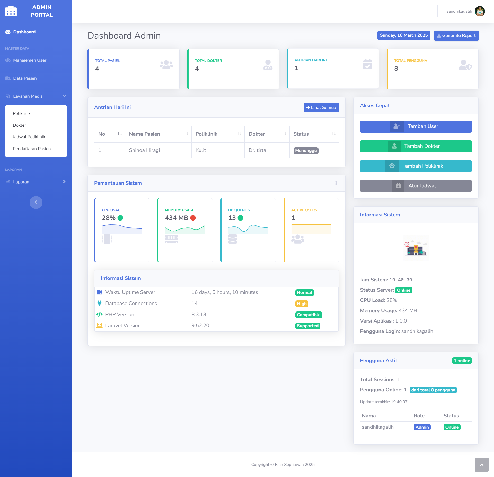
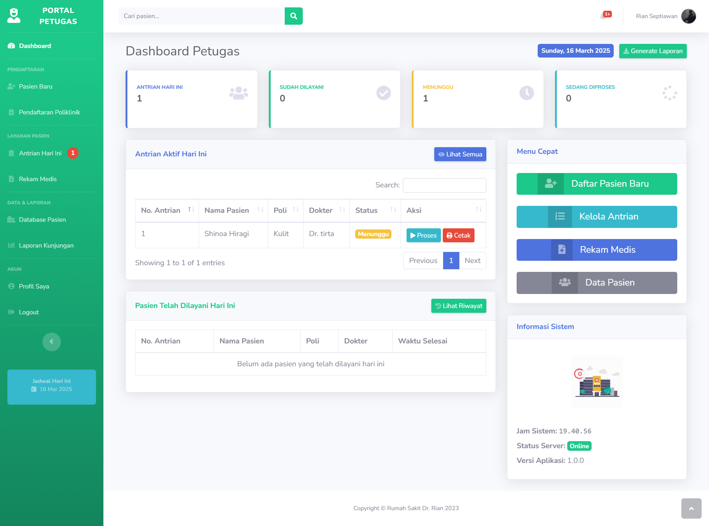
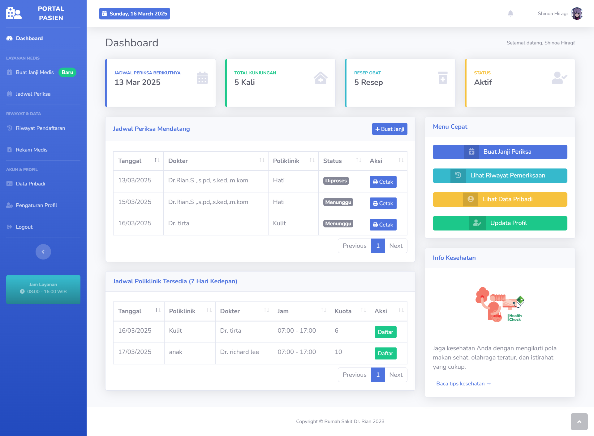

<div align="right">

<a href="README.md"></a> |
<a href="README-ID.md"></a>

</div>

# 🏥 Sistem Manajemen Rumah Sakit

<div align="center">


</div>

Aplikasi web komprehensif untuk mengelola operasi rumah sakit, janji temu, dan rekam medis pasien yang dibangun dengan Laravel.


## ✨ Fitur

### Sistem Multi-Peran

-   **👩‍💼 Admin**: Manajemen sistem, kontrol pengguna, dan analitik
-   **👨‍⚕️ Staff**: Pendaftaran pasien, penanganan janji temu, dan rekam medis
-   **🧑‍🤝‍🧑 Pasien**: Booking janji temu, pelacakan antrian, dan akses riwayat medis

### Portal Admin



-   Dashboard komprehensif dengan metrik real-time
-   Manajemen pengguna (buat, perbarui, hapus)
-   Manajemen departemen/poliklinik
-   Penjadwalan dokter
-   Pemantauan kinerja sistem
-   Pelaporan dan analitik

### Portal Staff



-   Pendaftaran dan manajemen pasien
-   Pemrosesan janji temu
-   Manajemen antrian
-   Akses rekam medis
-   Laporan pasien harian

### Portal Pasien



-   Booking janji temu
-   Pelacakan antrian
-   Akses riwayat medis
-   Riwayat resep
-   Manajemen profil
-   Sistem penilaian layanan

## 🛠️ Teknologi yang Digunakan

<div align="center">

<a href=""></a> <a href=""></a> <a href=""></a>

</div>

## 📋 Persyaratan

-   PHP >= 8.0
-   MySQL
-   Composer
-   Node.js & NPM

## 🚀 Instalasi

1. **Clone repositori**

```bash
git clone https://github.com/yourusername/hospital-management-system.git
cd hospital-management-system
```

2. **Instal dependensi PHP**

```bash
composer install
```

3. **Instal dependensi JavaScript**

```bash
npm install && npm run dev
```

4. **Konfigurasi lingkungan**

```bash
cp .env.example .env
```

5. **Perbarui pengaturan database di .env**

```
DB_CONNECTION=mysql
DB_HOST=127.0.0.1
DB_PORT=3306
DB_DATABASE=hospital_management
DB_USERNAME=root
DB_PASSWORD=
```

6. **Generate kunci aplikasi**

```bash
php artisan key:generate
```

7. **Jalankan migrasi dan seeder**

```bash
php artisan migrate --seed
```

8. **Mulai server pengembangan**

```bash
php artisan serve
```

## 👥 Kredensial Login Default

| Peran  | Email               | Password |
| ------ | ------------------- | -------- |
| Admin  | admin@example.com   | password |
| Staff  | staff@example.com   | password |
| Pasien | patient@example.com | password |

## 📊 Arsitektur Sistem

```
app/
├── Http/
│   ├── Controllers/      # Kontroler rute
│   ├── Middleware/       # Middleware permintaan
│   └── Requests/         # Form requests
├── Models/               # Model database
├── Providers/            # Penyedia layanan
├── Services/             # Logika bisnis
└── Resources/
    ├── views/            # Template Blade
    ├── js/               # JavaScript
    └── css/              # Stylesheet
```

## 🔄 Alur Kerja

1. Pasien mendaftar dan membuat janji temu
2. Staff memproses janji temu dan mengelola antrian
3. Dokter memeriksa pasien dan memperbarui rekam medis
4. Admin mengawasi seluruh sistem dan menghasilkan laporan

## 📚 Dokumentasi

Dokumentasi detail tersedia di direktori `docs/`:

-   [Dokumentasi](docs/installation.md)

## 🤝 Kontribusi

Kontribusi sangat disambut! Silakan kirimkan Pull Request.

## 📝 Lisensi

Proyek ini dilisensikan di bawah Lisensi MIT - lihat file [LICENSE](LICENSE) untuk detailnya.

## 👏 Ucapan Terima Kasih

-   Komunitas Laravel
-   Tim Bootstrap
-   Semua kontributor yang telah membantu meningkatkan sistem ini

## Kontak

Jika Anda memiliki pertanyaan atau saran, silakan buka issue baru di repositori ini.

[](https://wa.me/6285157517798)
[](https://www.linkedin.com/in/rian-septiawan-23b0a5351/)
[](https://www.instagram.com/ryan.septiawan__/)
